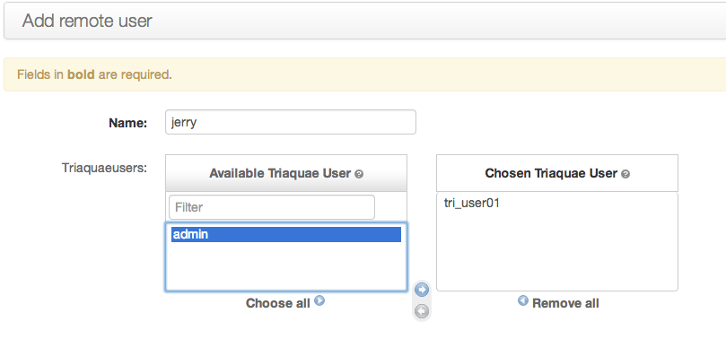

绑定远程用户
==================

在TriAquae administration中,点击"Remote Users".

 
.. note::

 在添加 remote user 时可以选择管理端哪些用户可以使用此用户执行任务.
 此功能基于用户的权限考虑,管理员可以根据需求进行设置.

.. hint::

 * 远程用户,指在远程主机既被管理主机上执行命令使用的用户.
 * 在使用时,要注意此用户需要在远程主机中存在,否则执行任务是会报错

